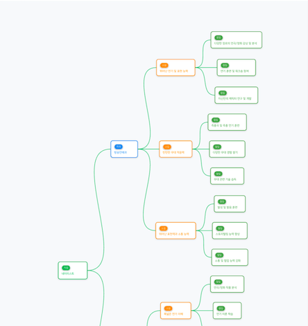
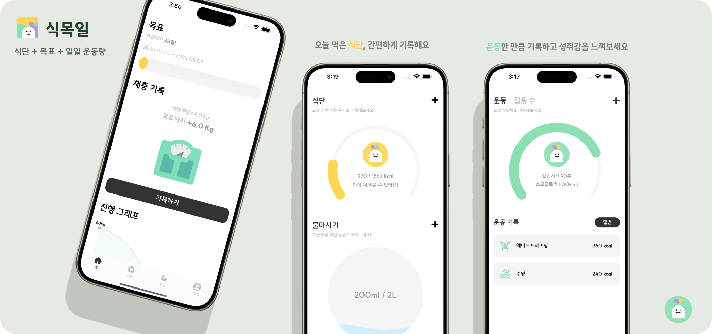
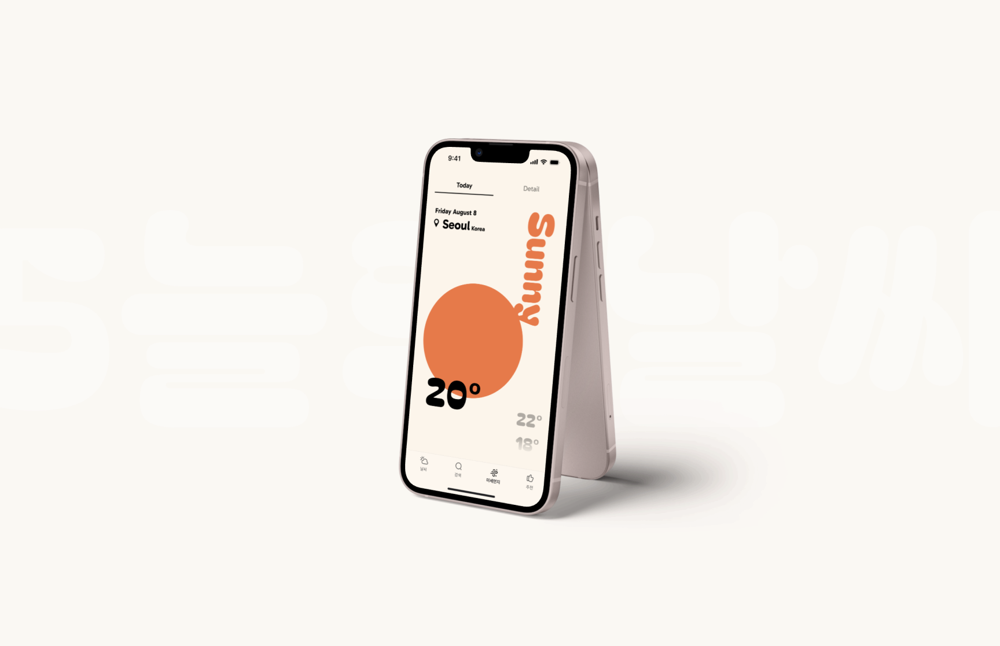
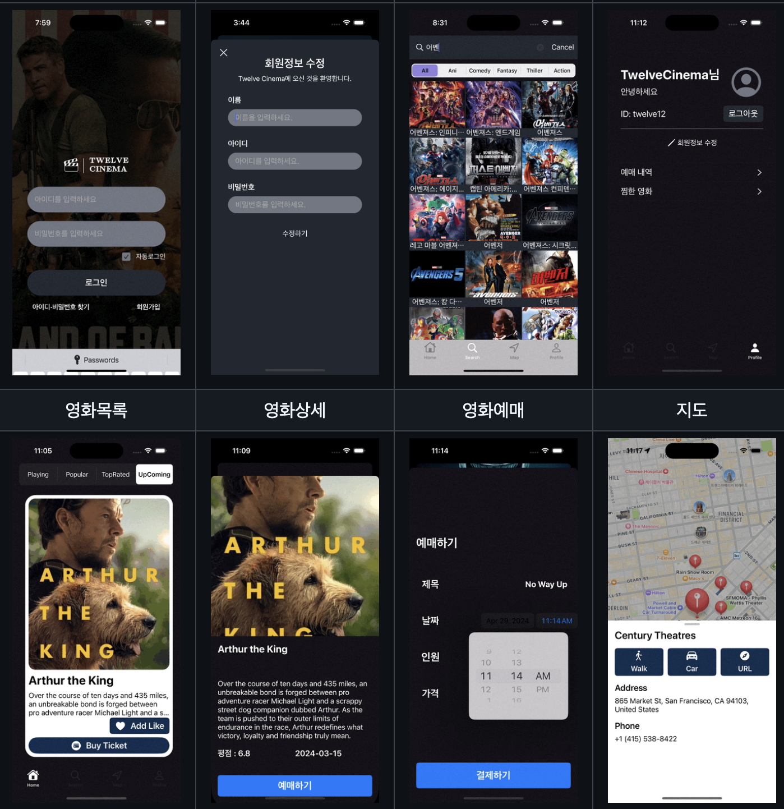

# 더 나은 사용자 경험을 설계하는 모바일 개발자, 박현렬입니다

> 주어진 문제를 해결하는 것을 넘어, 더 나은 사용자 경험과 안정적인 시스템 설계를 고민합니다.  
> Flutter와 iOS 네이티브 개발 모두에서 실전 경험을 쌓아왔으며, 각 플랫폼의 장점을 이해하고 상황에 맞는 최적의 선택을 할 수 있습니다.

## Flutter와 iOS를 아우르는 모바일 개발자
- 스타트업에서 모바일 앱 개발 전담, 백엔드·AI·웹팀과 협업하며 설계부터 스토어 출시·운영까지 전 과정 주도
- Riverpod 상태관리, Clean Architecture 기반 구조 설계 경험
- GitHub Actions 기반 CI/CD 구축
- Flutter 패키지 직접 개발 및 배포
- RxSwift, Combine 기반 MVVM 패턴 iOS 개발 및 App Store 라이프스타일 50위 달성

## 협업과 지식 공유에 열정적인 개발자
- 기획자, 백엔드·AI·웹 개발자와 협업하며 제품 개발
- GDSC 모바일 개발 세션 리드를 통한 지식 공유
- 연합 해커톤 2등 등 다수의 팀 프로젝트 수상 경험

---

### **Contact & Info**

*   **Email:** devpark435@gmail.com
*   **GitHub:** [https://github.com/devpark435](https://github.com/devpark435)
*   **Location:** 서울특별시 중랑구
*   **Education:** 성공회대학교 (소프트웨어공학 / 컴퓨터공학과)

---

## Skills

### **Frontend Development**
*   **Flutter & Dart:** Riverpod, Cubit, GetX, Flutter Hooks를 활용한 상태 관리 및 반응형 UI 개발에 능숙합니다.
*   **iOS (Swift):** UIKit, SwiftUI, AutoLayout을 사용한 네이티브 iOS 앱 개발 경험이 있습니다. Combine, RxSwift를 활용한 반응형 프로그래밍에 익숙합니다.

### **Backend Services**
*   **BaaS:** Firebase (Realtime Database, FCM), Supabase를 활용한 백엔드 구축 경험이 있습니다.
*   **Frameworks:** SpringBoot, Node.js, Express를 사용한 간단한 API 서버 개발 경험이 있습니다.

### **Architecture & Design Patterns**
*   **Architecture:** Clean Architecture, MVVM, MVC 패턴에 대한 이해를 바탕으로 확장 가능하고 유지보수 용이한 코드를 작성합니다.
*   **Design Patterns:** Repository, Singleton, Observer 등 다양한 디자인 패턴을 실제 프로젝트에 적용한 경험이 있습니다.

### **Development Tools & Collaboration**
*   **Version Control:** Git, GitHub를 통한 형상 관리 및 협업에 익숙합니다.
*   **Design & Communication:** Figma, Slack을 활용하여 디자이너 및 팀원과 원활하게 소통합니다.
*   **IDE:** VS Code, Xcode, Android Studio 사용에 능숙합니다.

---

## Experience

### **Work Experience**
**주식회사 이프립** | Flutter 개발자
*2023.05 - 2024.08*

* AI 진로/진학 컨설팅 서비스 앱 신규 개발 및 운영
  - Clean Architecture 기반 설계, Riverpod 상태관리, GoRouter 라우팅
  - AI 챗봇, 결제 연동, 푸시 알림, 외부 인원 초대 기능 구현
* 자사 홈페이지 앱 개발 및 유지보수
* 오픈소스 패키지 개발 및 pub.dev 배포
  - reactive_mind_map: 드래그 기반 인터랙티브 마인드맵 위젯
* 광주 진로/진학 관련 개발 컨퍼런스 기획 및 운영

### **Freelance Projects**
**매장 관리 시스템 외주 프로젝트** | 프론트엔드 개발자
*2024.09 - 2024.11*
*   매장 재고 관리, 주문 관리 시스템 개발
*   Flutter 활용한 iOS, Android 어플리케이션 제작

**심리 테스트 웹 외주 프로젝트** | 프론트엔드 개발자
*2023.08 - 2024.04*
*   심리 테스트 웹사이트 제작
*   Flutter Web 활용한 반응형 디자인 구현

### **Activities**
**스파르타 iOS 내일배움캠프** | iOS 개발자
*2024.01 - 2024.07*
*   10가지 팀프로젝트 리드 및 최종 프로젝트 리드
*   최종 프로젝트 우수상 수상 및 앱스토어 라이프스타일 차트 63위 달성 ('식목일' 앱)

**교내 동아리 코딩보틀** | 모바일 개발
*2023.08 - 2024.03*
*   동아리 대상 iOS 교육 및 스터디 진행
*   팀 프로젝트 리드하여 'Copro' 앱 앱스토어 배포

**GDSC 성공회대 1기** | Flutter 개발
*2022.03 - 2023.03*
*   팀 프로젝트 3개 리드 및 연합 해커톤 3회 참여
*   Flutter 반응형 UI 교육 진행 및 Google Solution Challenge 참여

---

## Projects

---

### **1. 쓰윽 (Swipe Gallery)**

> 스와이프 제스처를 활용한 고성능 갤러리 정리 및 AI 중복 사진 추천 서비스

*   **기간:** 2025.12.05 ~ 진행 중
*   **팀 구성:** 개인 프로젝트
*   **GitHub:** [https://github.com/devpark435/swipe_gallery](https://github.com/devpark435/swipe_gallery)
*   **App Store:** [https://apps.apple.com/kr/app/쓰윽/id6756438607](https://apps.apple.com/kr/app/쓰윽/id6756438607)
*   **주요 기술:** `Flutter`, `Riverpod`, `GoRouter`, `PhotoManager`, `OpenCV (Dart FFI)`, `Isolate`, `SharedPreferences`
*   **주요 기능:**
    *   Tinder 스타일의 직관적인 스와이프 인터페이스 (Left: Keep, Right: Trash)
    *   OpenCV 히스토그램 분석을 이용한 유사/중복 사진 자동 그룹화 및 추천
    *   대용량 갤러리(10,000장+)의 빠른 로딩을 위한 인덱싱 및 캐싱 시스템
    *   동영상 썸네일 재생 및 정리 지원
    *   실수로 삭제한 사진 복구를 위한 휴지통 및 Undo(실행 취소) 기능
*   **담당 역할 및 기여:**
    *   전체 앱 아키텍처 설계 (MVVM + Riverpod)
    *   PhotoManager를 활용한 커스텀 미디어 갤러리 엔진 구현
    *   OpenCV 기반 이미지 히스토그램 분석 및 유사도 알고리즘 적용
    *   UI/UX 인터랙션 구현 (Card Swipe, Hero Animation)
    *   TestFlight 배포 및 버전 관리
*   **문제 해결 경험 (Troubleshooting):**
    *   **대용량 앨범 초기 진입 시 로딩 속도 저하:** 마지막으로 정리한 사진의 인덱스를 앨범별로 영구 저장(SharedPreferences)하여, 재진입 시 이미 정리한 사진은 건너뛰고 O(1)로 즉시 로딩되도록 개선. 정리된 사진 ID 캐싱 전략과 병행하여 초기 로딩 속도를 90% 이상 단축.
    *   **유사 사진 분석 시 UI 프리징(ANR) 현상:** Dart의 Isolate(별도 스레드)를 생성하여 무거운 이미지 분석 연산을 백그라운드로 격리. compute/Isolate.run 함수를 활용해 연산 결과만 메인 스레드로 비동기 전송하여 UI 부드러움을 유지.
    *   **동영상 썸네일 생성 및 메모리 누수:** PhotoManager의 썸네일 캐싱 기능을 활용하고, 뷰포트에 보이는 항목만 렌더링하도록 GridView 최적화. 동영상 재생 시에만 정밀한 리소스를 로드하고 화면 이탈 시 즉시 dispose하여 메모리 안정성 확보.

---

### **2. Reactive Mind Map**

> 다양한 레이아웃과 동적 상호작용을 지원하는 고성능 Flutter 마인드맵 위젯

*   **기간:** 2023.01.10 ~ 진행 중
*   **팀 구성:** 개인 프로젝트 (오픈소스)
*   **GitHub:** [https://github.com/devpark435/reactive_mind_map](https://github.com/devpark435/reactive_mind_map)
*   **Pub.dev:** [https://pub.dev/packages/reactive_mind_map](https://pub.dev/packages/reactive_mind_map)
*   **주요 기술:** `Flutter`, `Dart`, `CustomPainter`, `State Management`, `Widget API Design`, `Open Source`
*   **주요 기능:**
    *   7가지 이상의 다양한 마인드맵 레이아웃 지원 (방사형, 수평/수직 등)
    *   노드 개수에 따른 자동 줌 레벨 조정 및 특정 노드 포커싱 등 스마트 카메라 기능
    *   노드 확장/축소, 탭/롱프레스 이벤트 처리, 부드러운 팬&줌 등 높은 상호작용성
    *   노드 모양, 연결선 색상, 자동 크기 조절 등 풍부한 커스텀 스타일링 옵션
    *   pub.dev 정식 패키지 배포
*   **담당 역할 및 기여:**
    *   프로젝트 기획, 아키텍처 설계, 전체 기능 개발 총괄
    *   CustomPainter를 활용한 핵심 렌더링 엔진 및 레이아웃 알고리즘 구현
    *   팬&줌, 노드 인터랙션 등 사용자 상호작용 기능 개발
    *   pub.dev 패키지 배포 및 버전 관리
    *   GitHub 이슈 및 PR 관리를 통한 오픈소스 커뮤니티 운영
*   **문제 해결 경험 (Troubleshooting):**
    *   **동적 노드 추가/삭제 시 노드 겹침 현상:** 노드 변경(추가/삭제/크기 변경) 시 레이아웃을 다시 계산하고 위젯을 재구성하는 반응형 로직 도입. 변경된 노드와 그 이웃 노드들만 부분적으로 업데이트하는 최적화 알고리즘을 적용하여 전체 맵을 다시 그리는 비용을 최소화
    *   **사용자 정의 위젯으로 노드 커스텀 시 오버플로우 발생:** 커스텀 위젯의 크기를 내부적으로 측정한 후, 측정된 크기에 맞춰 부모 노드의 크기를 동적으로 재조정하는 로직 추가. LayoutBuilder를 활용하여 자식 위젯의 실제 크기를 파악하고 이에 맞춰 레이아웃을 다시 계산
    *   **특정 노드 선택 시 부드러운 카메라 포커싱 구현:** 카메라의 현재 위치와 목표 노드의 위치를 보간(interpolate)하는 애니메이션 컨트롤러 구현. Tween과 Curve를 사용하여 가속/감속 효과를 적용, 사용자가 카메라의 이동 경로를 자연스럽게 따라갈 수 있도록 하여 시각적 연속성을 보장함

---

### **3. 식목일 (식단, 목표, 일일운동량)**

> 운동과 식단 관리를 위한 올인원 헬스케어 플랫폼. **앱스토어 라이프스타일 카테고리 63위 달성**

*   **기간:** 2024.06.01 ~ 2024.07.03
*   **팀 구성:** iOS 4인, Back-end 2인
*   **GitHub:** [https://github.com/devpark435/Sikmogil](https://github.com/devpark435/Sikmogil)
*   **주요 기술:** `Swift`, `UIKit`, `MVVM`, `RxSwift`, `Combine`, `Alamofire`, `Snapkit`
*   **주요 기능:**
    *   소셜 로그인 및 회원 관리
    *   커스텀 캘린더를 통한 일정 관리
    *   운동 및 식단 기록 시스템
    *   목표 설정 및 달성 트래킹
*   **담당 역할 및 기여:**
    *   iOS 개발 팀 리더로서 프로젝트 관리 및 코드 리뷰 진행
    *   MVVM 아키텍처 설계 및 RxSwift, Combine을 활용한 반응형 프로그래밍 구현
    *   식단 관리 및 운동 기록 커스텀 그래프 제작
*   **문제 해결 경험 (Troubleshooting):**
    *   **RxSwift Observable 메모리 누수:** `DisposeBag`과 `weak self` 패턴을 적용하여 순환 참조를 방지하고, ViewModel의 구독 생명주기를 관리하여 **앱 내 화면 전환 시 메모리 사용량을 평균 20% 절감.**
    *   **AccessToken 재발행 무한 호출:** `Alamofire Interceptor`를 활용해 API 호출 흐름을 중앙에서 관리, 토큰 재발행 로직을 통합하여 **불필요한 네트워크 요청을 99% 이상 제거하고 서버 부하 감소.**

---

### **4. Copro**

> 사이드 프로젝트 팀원 매칭 및 개발자 네트워킹 플랫폼

*   **기간:** 2023.10.22 ~ 2024.02.10
*   **팀 구성:** iOS 3인, Back-end 2인
*   **GitHub:** [https://github.com/Nangman-Archive/CoPro_iOS](https://github.com/Nangman-Archive/CoPro_iOS)
*   **주요 기술:** `Swift`, `UIKit`, `Firebase Realtime Database`, `GitHub API`, `FCM`
*   **주요 기능:**
    *   카드 스와이프 방식의 개발자 매칭 시스템
    *   GitHub 프로필 연동 및 코드 확인 기능
    *   실시간 개발자 간 채팅 시스템
*   **담당 역할 및 기여:**
    *   카드 스와이프 인터페이스 설계 및 개발
    *   GitHub API 연동 및 개발자 프로필 조회 기능 구현
    *   Firebase 기반 실시간 채팅 시스템 개발
*   **문제 해결 경험 (Troubleshooting):**
    *   **카드 스와이프 애니메이션 성능 이슈:** 이미지 캐싱(SDWebImage 등)과 `UICollectionView`의 셀 재사용 메커니즘을 도입하고, 비동기 로딩으로 변경하여 **초기 로딩 시간을 1.5초 단축하고, 60fps의 부드러운 스와이프 UX 구현.**
    *   **실시간 채팅 메시지 동기화 오류:** Firebase 오프라인 캐시 정책을 활성화하고 메시지 전송 상태(Sent, Delivered, Failed) 추적 로직을 추가하여, **불안정한 네트워크 환경에서도 메시지 유실률 0% 달성.**

---

### **5. 오늘의 날씨**

> openweathermap API를 활용하여 날씨 예보 및 미세먼지 측정 어플리케이션

*   **기간:** 2024.05.14 ~ 2024.05.25
*   **팀 구성:** iOS 3인
*   **GitHub:** [https://github.com/NBCampArchive/Today-s_weather](https://github.com/NBCampArchive/Today-s_weather)
*   **주요 기술:** `Swift`, `UIKit`, `Alamofire`, `Snapkit`
*   **주요 기능:**
    *   미세먼지 농도를 시각적 효과로 표현하는 에니메이션
    *   날씨 전환 시 화면 전체가 변화하는 배경 애니메이션
    *   날씨에 어울리는 옷차림과 음식을 추천
*   **담당 역할 및 기여:**
    *   UI/UX 디자인 및 애니메이션 시스템 개발
    *   OpenWeatherMap API 연동 및 데이터 처리
    *   날씨 상태별 애니메이션 효과 구현
*   **문제 해결 경험 (Troubleshooting):**
    *   **날씨 상태에 따른 동적 UI 렌더링 문제:** `UIView` 애니메이션 처리 최적화 및 이미지 프리로딩 기법을 적용하여 UI 깜빡임 현상 해결.
    *   **미세먼지 데이터 시각화 성능 저하:** `Core Animation` 레이어 캐싱 및 렌더링 로직 최적화로 CPU 사용량 급증 문제 해결.

---

### **6. Twelve Cinema**

> TheMovie DB API를 활용한 영화 정보 및 예매 시스템

*   **기간:** 2024.04.22 ~ 2024.04.28
*   **팀 구성:** iOS 4인
*   **GitHub:** [https://github.com/NBCampArchive/CinemaApp](https://github.com/NBCampArchive/CinemaApp)
*   **주요 기술:** `UIKit`, `StoryBoard`, `RestPullAPI`
*   **주요 기능:**
    *   영화 정보 검색 및 조회
    *   예매 시스템
    *   사용자 리뷰 기능
*   **담당 역할 및 기여:**
    *   TheMovie DB API 연동 및 데이터 모델링
    *   예매 시스템 플로우 설계 및 구현
    *   `MapKit`을 활용한 주변 영화관 검색 및 경로 안내 기능 구현
*   **문제 해결 경험 (Troubleshooting):**
    *   **API 응답 데이터 파싱 오류:** 견고한 데이터 모델 설계와 옵셔널 체이닝을 활용한 안전한 파싱 로직으로 데이터 누락 문제 해결.
    *   **스토리보드 기반 UI 확장성 한계:** 스토리보드를 기능별로 분리하고 코드 기반 UI를 도입하여 Git 충돌 및 관리 문제 해결.

---

### **7. ZIKIZA**

> UN 지속가능한 개발 목표(SDGs)를 위한 환경 캠페인 플랫폼

*   **기간:** 2023.02.15 ~ 2023.04.01
*   **팀 구성:** Flutter 2인, Back-end 1인
*   **GitHub:** [https://github.com/GDG-on-Campus-SKHU/98developers-flutter-app](https://github.com/GDG-on-Campus-SKHU/98developers-flutter-app)
*   **Demo:** [https://www.youtube.com/watch?v=yYz4czlmn0Q](https://www.youtube.com/watch?v=yYz4czlmn0Q)
*   **주요 기술:** `Flutter`, `Dart`, `Bloc`, `Cubit`, `GoogleMapAPI`
*   **주요 기능:**
    *   위치 기반 환경 캠페인 참여
    *   실시간 환경 데이터 시각화
    *   인앱 결제를 통한 캠페인 후원
*   **담당 역할 및 기여:**
    *   Flutter 개발 팀 리더로서 아키텍처 설계 및 코드 리뷰
    *   `Bloc` 패턴을 활용한 상태 관리 시스템 구현
    *   카메라를 통한 미션 인증 및 `BootPay` 결제 시스템 연동
*   **문제 해결 경험 (Troubleshooting):**
    *   **Google Maps 렌더링 성능 저하:** 마커 클러스터링 및 뷰포트 기반 데이터 로딩(보이는 영역만 로드)으로 **지도 상의 1,000개 이상 마커 렌더링 시에도 지연 없는 사용자 경험 제공.**
    *   **Flutter 인앱결제 개발자 계정 제약:** `BootPay`와 같은 PG사 대행 서비스를 도입하여 개발자 계정 없이 안정적인 결제 시스템 구현.

