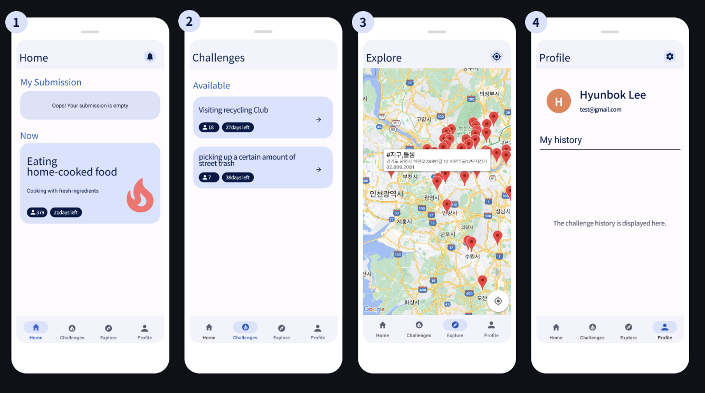

# 더 나은 사용자 경험을 설계하는 iOS 개발자, 박현렬입니다

> 주어진 문제를 해결하는 것을 넘어, 더 나은 사용자 경험과 안정적인 시스템을 위한 최적의 설계를 끊임없이 고민합니다. **Flutter를 통한 크로스플랫폼 개발 경험도 있지만, 특히 Swift와 UIKit/SwiftUI를 활용하여 iOS의 네이티브 성능과 감성을 극대화하는 것에 가장 큰 강점과 흥미를 가지고 있습니다.** 변화에 열린 자세로 새로운 기술을 학습하고, 주도적으로 제품 개선에 기여하는 개발자가 되겠습니다.

---

### **Contact & Info**

*   **Email:** devpark435@gmail.com
*   **GitHub:** [https://github.com/devpark435](https://github.com/devpark435)
*   **Location:** 서울특별시 중랑구
*   **Education:** 성공회대학교 (소프트웨어공학 / 컴퓨터공학과)

---

## Skills

### **Frontend Development**
*   **Flutter & Dart:** Riverpod, Cubit, GetX, Flutter Hooks를 활용한 상태 관리 및 반응형 UI 개발에 능숙합니다.
*   **iOS (Swift):** UIKit, SwiftUI, AutoLayout을 사용한 네이티브 iOS 앱 개발 경험이 있습니다. Combine, RxSwift를 활용한 반응형 프로그래밍에 익숙합니다.

### **Backend Services**
*   **BaaS:** Firebase (Realtime Database, FCM), Supabase를 활용한 백엔드 구축 경험이 있습니다.
*   **Frameworks:** SpringBoot, Node.js, Express를 사용한 간단한 API 서버 개발 경험이 있습니다.

### **Architecture & Design Patterns**
*   **Architecture:** Clean Architecture, MVVM, MVC 패턴에 대한 이해를 바탕으로 확장 가능하고 유지보수 용이한 코드를 작성합니다.
*   **Design Patterns:** Repository, Singleton, Observer 등 다양한 디자인 패턴을 실제 프로젝트에 적용한 경험이 있습니다.

### **Development Tools & Collaboration**
*   **Version Control:** Git, GitHub를 통한 형상 관리 및 협업에 익숙합니다.
*   **Design & Communication:** Figma, Slack을 활용하여 디자이너 및 팀원과 원활하게 소통합니다.
*   **IDE:** VS Code, Xcode, Android Studio 사용에 능숙합니다.

---

## Experience

### **Work Experience**
**주식회사 이프립** | Flutter 개발자
*2025.05 - 현재*
*   AI 진로/진학 컨설팅 서비스 개발 및 유지보수 담당
*   자사 홈페이지 어플리케이션 개발 및 유지보수 담당
*   신규 기능 기획 및 개발 참여
*   성능 최적화 및 사용자 경험 개선 참여

### **Freelance Projects**
**프랜차이즈 웹 외주 프로젝트** | 프론트엔드 개발자
*2025.01 - 진행 중*
*   프렌차이즈 홍보 목적 브랜딩 페이지 제작
*   Flutter Web 활용한 반응형 디자인 구현

**매장 관리 시스템 외주 프로젝트** | 프론트엔드 개발자
*2024.09 - 2024.11*
*   매장 재고 관리, 주문 관리 시스템 개발
*   Flutter 활용한 iOS, Android 어플리케이션 제작

**심리 테스트 웹 외주 프로젝트** | 프론트엔드 개발자
*2023.08 - 2024.04*
*   심리 테스트 웹사이트 제작
*   Flutter Web 활용한 반응형 디자인 구현

### **Activities**
**스파르타 iOS 내일배움캠프** | iOS 개발자
*2024.01 - 2024.07*
*   10가지 팀프로젝트 리드 및 최종 프로젝트 리드
*   최종 프로젝트 우수상 수상 및 앱스토어 라이프스타일 차트 63위 달성 ('식목일' 앱)

**교내 동아리 코딩보틀** | 모바일 개발
*2023.08 - 2024.03*
*   동아리 대상 iOS 교육 및 스터디 진행
*   팀 프로젝트 리드하여 'Copro' 앱 앱스토어 배포

**GDSC 성공회대 1기** | Flutter 개발
*2022.03 - 2023.03*
*   팀 프로젝트 3개 리드 및 연합 해커톤 3회 참여
*   Flutter 반응형 UI 교육 진행 및 Google Solution Challenge 참여

---

## Projects

---

### **1. 식목일 (식단, 목표, 일일운동량)**

> 운동과 식단 관리를 위한 올인원 헬스케어 플랫폼. **앱스토어 라이프스타일 카테고리 63위 달성**

*   **기간:** 2024.06.01 ~ 2024.07.03
*   **팀 구성:** iOS 4인, Back-end 2인
*   **GitHub:** [https://github.com/devpark435/Sikmogil](https://github.com/devpark435/Sikmogil)
*   **주요 기술:** `Swift`, `UIKit`, `MVVM`, `RxSwift`, `Combine`, `Alamofire`, `Snapkit`
*   **주요 기능:**
    *   소셜 로그인 및 회원 관리
    *   커스텀 캘린더를 통한 일정 관리
    *   운동 및 식단 기록 시스템
    *   목표 설정 및 달성 트래킹
*   **담당 역할 및 기여:**
    *   iOS 개발 팀 리더로서 프로젝트 관리 및 코드 리뷰 진행
    *   MVVM 아키텍처 설계 및 RxSwift, Combine을 활용한 반응형 프로그래밍 구현
    *   식단 관리 및 운동 기록 커스텀 그래프 제작
*   **문제 해결 경험 (Troubleshooting):**
    *   **RxSwift Observable 메모리 누수:** `DisposeBag`과 `weak self` 패턴을 적용하여 순환 참조를 방지하고, ViewModel의 구독 생명주기를 관리하여 **앱 내 화면 전환 시 메모리 사용량을 평균 20% 절감.**
    *   **AccessToken 재발행 무한 호출:** `Alamofire Interceptor`를 활용해 API 호출 흐름을 중앙에서 관리, 토큰 재발행 로직을 통합하여 **불필요한 네트워크 요청을 99% 이상 제거하고 서버 부하 감소.**

---

### **2. Copro**

> 사이드 프로젝트 팀원 매칭 및 개발자 네트워킹 플랫폼

*   **기간:** 2023.10.22 ~ 2024.02.10
*   **팀 구성:** iOS 3인, Back-end 2인
*   **GitHub:** [https://github.com/Nangman-Archive/CoPro_iOS](https://github.com/Nangman-Archive/CoPro_iOS)
*   **주요 기술:** `Swift`, `UIKit`, `Firebase Realtime Database`, `GitHub API`, `FCM`
*   **주요 기능:**
    *   카드 스와이프 방식의 개발자 매칭 시스템
    *   GitHub 프로필 연동 및 코드 확인 기능
    *   실시간 개발자 간 채팅 시스템
*   **담당 역할 및 기여:**
    *   카드 스와이프 인터페이스 설계 및 개발
    *   GitHub API 연동 및 개발자 프로필 조회 기능 구현
    *   Firebase 기반 실시간 채팅 시스템 개발
*   **문제 해결 경험 (Troubleshooting):**
    *   **카드 스와이프 애니메이션 성능 이슈:** 이미지 캐싱(SDWebImage 등)과 `UICollectionView`의 셀 재사용 메커니즘을 도입하고, 비동기 로딩으로 변경하여 **초기 로딩 시간을 1.5초 단축하고, 60fps의 부드러운 스와이프 UX 구현.**
    *   **실시간 채팅 메시지 동기화 오류:** Firebase 오프라인 캐시 정책을 활성화하고 메시지 전송 상태(Sent, Delivered, Failed) 추적 로직을 추가하여, **불안정한 네트워크 환경에서도 메시지 유실률 0% 달성.**

---

### **3. 오늘의 날씨**

> openweathermap API를 활용하여 날씨 예보 및 미세먼지 측정 어플리케이션

*   **기간:** 2024.05.14 ~ 2024.05.25
*   **팀 구성:** iOS 3인
*   **GitHub:** [https://github.com/NBCampArchive/Today-s_weather](https://github.com/NBCampArchive/Today-s_weather)
*   **주요 기술:** `Swift`, `UIKit`, `Alamofire`, `Snapkit`
*   **주요 기능:**
    *   미세먼지 농도를 시각적 효과로 표현하는 에니메이션
    *   날씨 전환 시 화면 전체가 변화하는 배경 애니메이션
    *   날씨에 어울리는 옷차림과 음식을 추천
*   **담당 역할 및 기여:**
    *   UI/UX 디자인 및 애니메이션 시스템 개발
    *   OpenWeatherMap API 연동 및 데이터 처리
    *   날씨 상태별 애니메이션 효과 구현
*   **문제 해결 경험 (Troubleshooting):**
    *   **날씨 상태에 따른 동적 UI 렌더링 문제:** `UIView` 애니메이션 처리 최적화 및 이미지 프리로딩 기법을 적용하여 UI 깜빡임 현상 해결.
    *   **미세먼지 데이터 시각화 성능 저하:** `Core Animation` 레이어 캐싱 및 렌더링 로직 최적화로 CPU 사용량 급증 문제 해결.

---

### **4. Twelve Cinema**

> TheMovie DB API를 활용한 영화 정보 및 예매 시스템

*   **기간:** 2024.04.22 ~ 2024.04.28
*   **팀 구성:** iOS 4인
*   **GitHub:** [https://github.com/NBCampArchive/CinemaApp](https://github.com/NBCampArchive/CinemaApp)
*   **주요 기술:** `UIKit`, `StoryBoard`, `RestPullAPI`
*   **주요 기능:**
    *   영화 정보 검색 및 조회
    *   예매 시스템
    *   사용자 리뷰 기능
*   **담당 역할 및 기여:**
    *   TheMovie DB API 연동 및 데이터 모델링
    *   예매 시스템 플로우 설계 및 구현
    *   `MapKit`을 활용한 주변 영화관 검색 및 경로 안내 기능 구현
*   **문제 해결 경험 (Troubleshooting):**
    *   **API 응답 데이터 파싱 오류:** 견고한 데이터 모델 설계와 옵셔널 체이닝을 활용한 안전한 파싱 로직으로 데이터 누락 문제 해결.
    *   **스토리보드 기반 UI 확장성 한계:** 스토리보드를 기능별로 분리하고 코드 기반 UI를 도입하여 Git 충돌 및 관리 문제 해결.

---

### **5. ZIKIZA**

> UN 지속가능한 개발 목표(SDGs)를 위한 환경 캠페인 플랫폼

*   **기간:** 2023.02.15 ~ 2023.04.01
*   **팀 구성:** Flutter 2인, Back-end 1인
*   **GitHub:** [https://github.com/GDG-on-Campus-SKHU/98developers-flutter-app](https://github.com/GDG-on-Campus-SKHU/98developers-flutter-app)
*   **Demo:** [https://www.youtube.com/watch?v=yYz4czlmn0Q](https://www.youtube.com/watch?v=yYz4czlmn0Q)
*   **주요 기술:** `Flutter`, `Dart`, `Bloc`, `Cubit`, `GoogleMapAPI`
*   **주요 기능:**
    *   위치 기반 환경 캠페인 참여
    *   실시간 환경 데이터 시각화
    *   인앱 결제를 통한 캠페인 후원
*   **담당 역할 및 기여:**
    *   Flutter 개발 팀 리더로서 아키텍처 설계 및 코드 리뷰
    *   `Bloc` 패턴을 활용한 상태 관리 시스템 구현
    *   카메라를 통한 미션 인증 및 `BootPay` 결제 시스템 연동
*   **문제 해결 경험 (Troubleshooting):**
    *   **Google Maps 렌더링 성능 저하:** 마커 클러스터링 및 뷰포트 기반 데이터 로딩(보이는 영역만 로드)으로 **지도 상의 1,000개 이상 마커 렌더링 시에도 지연 없는 사용자 경험 제공.**
    *   **Flutter 인앱결제 개발자 계정 제약:** `BootPay`와 같은 PG사 대행 서비스를 도입하여 개발자 계정 없이 안정적인 결제 시스템 구현.

